# Tugas Praktikum 3 - Desain dan Pemrograman Berorientasi Objek (DPBO) 2026

## Janji
Saya Luthfi Naufal Alfareza dengan NIM 2511437 mengerjakan Tugas Praktikum 3 dalam mata kuliah Desain dan Pemrograman Berorientasi Objek untuk keberkahan-Nya maka saya tidak akan melakukan kecurangan seperti yang telah dispesifikasikan. Aamiin.

---

## Struktur Direktori Proyek
```
TP3DPBO2526C1/
├── CPP
│   ├── Dokumentasi
│   │   ├── cpp_tambah_digital.png
│   │   ├── cpp_tambah_fisik.png
│   │   ├── cpp_tampil_after.png
│   │   └── cpp_tampil_before.png
│   └── Program
│       ├── Developer.cpp
│       ├── GameDigital.cpp
│       ├── GameFisik.cpp
│       ├── input.txt
│       ├── Main.cpp
│       ├── ProdukGame.cpp
│       └── TokoGame.cpp
├── Java
│   ├── Dokumentasi
│   │   ├── java_tambah_digital.png
│   │   ├── java_tambah_fisik.png
│   │   ├── java_tampil_after.png
│   │   └── java_tampil_before.png
│   └── Program
│       ├── Developer.java
│       ├── GameDigital.java
│       ├── GameFisik.java
│       ├── input.txt
│       ├── Main.java
│       ├── ProdukGame.java
│       └── TokoGame.java
├── Python
│   ├── Dokumentasi
│   │   ├── py_tambah_digital.png
│   │   ├── py_tambah_fisik.png
│   │   ├── py_tampil_after.png
│   │   └── py_tampil_before.png
│   └── Program
│       ├── Developer.py
│       ├── GameDigital.py
│       ├── GameFisik.py
│       ├── input.txt
│       ├── Main.py
│       ├── ProdukGame.py
│       └── TokoGame.py
├── diagram.drawio
├── diagram.jpg
└── README.md
```

---

## Desain Diagram Kelas (UML Diagram)

<p align="center">
  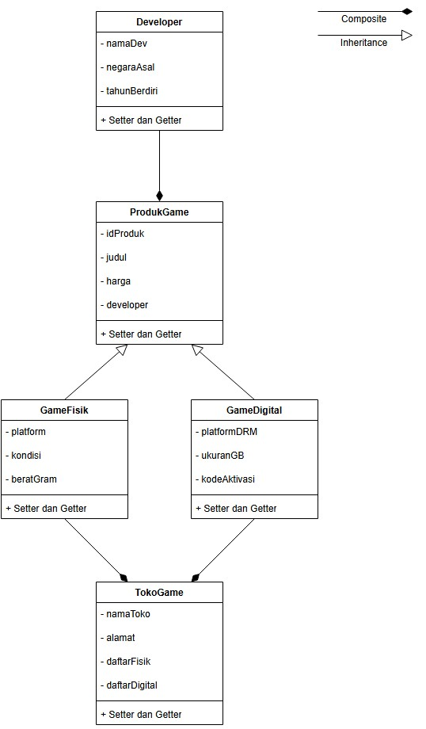
</p>

---

## Penjelasan Desain Program

Program ini mengusung tema **"Sistem Manajemen Inventaris Toko Game"** (*Toko Game*) yang mengimplementasikan 3 pilar utama sesuai spesifikasi tugas:

1. **Composition (Komposisi):**
   - **Komposisi Objek Tunggal (`ProdukGame` has-a `Developer`):** Setiap produk game memiliki komponen objek `Developer` yang merepresentasikan studio pembuat game tersebut. Objek `Developer` melekat secara erat sebagai bagian dari spesifikasi identitas `ProdukGame`.
   - **Komposisi Kontainer Koleksi (`TokoGame` has-a `Daftar Produk`):** Kelas `TokoGame` memiliki dan mengelola koleksi produk (`GameFisik` dan `GameDigital`).

2. **Hierarchical Inheritance (Pewarisan Hierarkis):**
   - Terdapat 1 Superclass/Parent yaitu **`ProdukGame`** yang mewariskan atribut umum (`idProduk`, `judul`, `harga`, `developer`) kepada 2 Subclass/Child:
     - **`GameFisik`**: Spesialisasi produk dalam bentuk fisik kaset/cartridge (memiliki atribut khusus: `platform`, `kondisi`, `beratGram`).
     - **`GameDigital`**: Spesialisasi produk dalam bentuk lisensi digital/serial key (memiliki atribut khusus: `platformDRM`, `ukuranGB`, `kodeAktivasi`).

3. **Array of Objects:**
   - Diimplementasikan di dalam kelas kontainer `TokoGame`:
     - C++: `std::vector<GameFisik>` dan `std::vector<GameDigital>`
     - Python: `list[GameFisik]` dan `list[GameDigital]`
     - Java: `java.util.List<GameFisik>` dan `java.util.List<GameDigital>`

---

## Penjelasan Atribut dan Methods

### 1. `Developer` (Component Class)
Mewakili studio pengembang video game.
- **Atribut:**
  - `namaDev` (string) : Nama studio pengembang.
  - `negaraAsal` (string) : Negara asal studio pengembang.
  - `tahunBerdiri` (int) : Tahun pendirian studio.
- **Methods:**
  - Constructor (Default & Parameterized)
  - `getNamaDev()` / `setNamaDev(string)` : Mengambil dan mengubah nama developer.
  - `getNegaraAsal()` / `setNegaraAsal(string)` : Mengambil dan mengubah negara asal developer.
  - `getTahunBerdiri()` / `setTahunBerdiri(int)` : Mengambil dan mengubah tahun pendirian.

### 2. `ProdukGame` (Superclass / Base Class)
Mewakili entitas umum produk game di toko.
- **Atribut:**
  - `idProduk` (string) : Kode unik produk game.
  - `judul` (string) : Judul video game.
  - `harga` (double) : Harga jual produk dalam Rupiah.
  - `developer` (Developer) : Objek developer pembuat game (*Composition*).
- **Methods:**
  - Constructor (Default & Parameterized)
  - `getIdProduk()` / `setIdProduk(string)` : Mengambil dan mengubah ID produk.
  - `getJudul()` / `setJudul(string)` : Mengambil dan mengubah judul game.
  - `getHarga()` / `setHarga(double)` : Mengambil dan mengubah harga game.
  - `getDeveloper()` / `setDeveloper(Developer)` : Mengambil dan mengubah objek developer.

### 3. `GameFisik` (Subclass extends `ProdukGame`)
Mewakili salinan fisik game (disc Blu-ray atau cartridge).
- **Atribut Tambahan:**
  - `platform` (string) : Platform konsol target (misal: "PlayStation 5", "Nintendo Switch").
  - `kondisi` (string) : Status kondisi barang (misal: "Segel Baru", "Bekas Like-New").
  - `beratGram` (int) : Bobot fisik barang untuk keperluan logistik pengiriman (gram).
- **Methods:**
  - Constructor (Default & Parameterized, memanggil constructor superclass)
  - `getPlatform()` / `setPlatform(string)` : Mengambil dan mengubah platform konsol.
  - `getKondisi()` / `setKondisi(string)` : Mengambil dan mengubah kondisi barang.
  - `getBeratGram()` / `setBeratGram(int)` : Mengambil dan mengubah bobot gram.

### 4. `GameDigital` (Subclass extends `ProdukGame`)
Mewakili lisensi unduhan game digital tanpa media fisik.
- **Atribut Tambahan:**
  - `platformDRM` (string) : Layanan distribusi digital (misal: "Steam", "Epic Games", "Steam VR").
  - `ukuranGB` (double) : Ukuran unduhan berkas instalasi game (Gigabyte).
  - `kodeAktivasi` (string) : Serial key lisensi aktivasi produk.
- **Methods:**
  - Constructor (Default & Parameterized, memanggil constructor superclass)
  - `getPlatformDRM()` / `setPlatformDRM(string)` : Mengambil dan mengubah platform launcher DRM.
  - `getUkuranGB()` / `setUkuranGB(double)` : Mengambil dan mengubah ukuran download file.
  - `getKodeAktivasi()` / `setKodeAktivasi(string)` : Mengambil dan mengubah kode aktivasi.

### 5. `TokoGame` (Container Class)
Mengelola seluruh inventaris dan katalog toko game.
- **Atribut:**
  - `namaToko` (string) : Nama toko game.
  - `alamat` (string) : Lokasi atau alamat operasional toko.
  - `daftarFisik` (List/Vector) : Array of Object untuk koleksi `GameFisik`.
  - `daftarDigital` (List/Vector) : Array of Object untuk koleksi `GameDigital`.
- **Methods:**
  - `tambahGameFisik(GameFisik)` : Menambahkan objek `GameFisik` baru ke koleksi.
  - `tambahGameDigital(GameDigital)` : Menambahkan objek `GameDigital` baru ke koleksi.
  - `findFisik(id)` / `findDigital(id)` : Mencari index objek berdasarkan ID.
  - `hapusFisik(index)` / `hapusDigital(index)` : Menghapus objek dari koleksi.
  - `tampilkanProfil()` : Mencetak informasi identitas toko dan total jumlah item.
  - `tampilkanTabelFisik()` : Menghitung lebar kolom secara dinamis dan mencetak tabel ASCII untuk katalog game fisik.
  - `tampilkanTabelDigital()` : Menghitung lebar kolom secara dinamis dan mencetak tabel ASCII untuk katalog game digital.
  - `tampilkanSemua()` : Memanggil profil dan kedua tabel katalog secara berurutan.

---

## Penjelasan Alur Program

Program mengimplementasikan antarmuka menu interaktif dengan format berikut:
```text
=== PROGRAM TOKO GAME ===
==============================
    SISTEM DATA TOKO GAME
==============================
1. Tambah Data
2. Tampilkan Data
3. Update Data
4. Hapus Data
5. Cari Data
0. Keluar
==============================
Pilih menu:
```

### Alur Eksekusi Menu:
1. **Inisialisasi Data Default:** Program memuat otomatis 5 objek awal (3 Game Fisik + 2 Game Digital).
2. **Menu 2 (Tampilkan Data):** Menampilkan semua data sebelum penambahan dalam format tabel ASCII dengan lebar kolom dinamis.
3. **Menu 1 (Tambah Data):** Meminta jenis game (1: Fisik, 2: Digital), lalu menerima input data atribut superclass, subclass, dan komponen developer.
4. **Menu 2 (Tampilkan Data):** Menampilkan semua data sesudah penambahan, memperlihatkan data baru yang telah masuk ke inventaris.
5. **Menu 3 (Update Data):** Mengubah data game berdasarkan ID.
6. **Menu 4 (Hapus Data):** Menghapus data game berdasarkan ID dengan konfirmasi `(y/n)`.
7. **Menu 5 (Cari Data):** Menampilkan rincian lengkap objek game berdasarkan ID.
8. **Menu 0 (Keluar):** Mengakhiri jalannya program.

---

## Dokumentasi Eksekusi Program

### 1. C++


| Tampilkan Data Sebelum (Show Before) | Tambah Game Fisik (Insert Physical) |
| :---: | :---: |
| 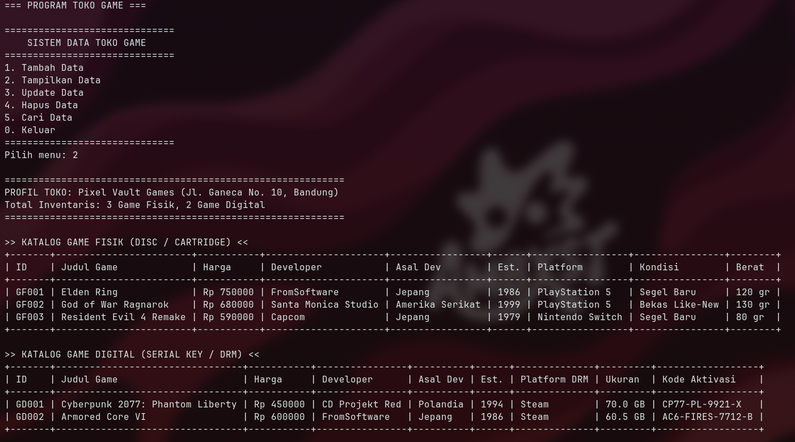 | 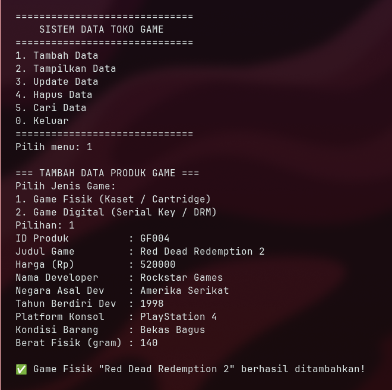 |
| **Tambah Game Digital (Insert Digital)** | **Tampilkan Data Setelah (Show After)** |
| 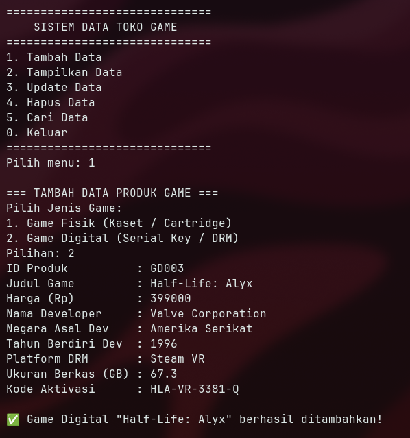 | 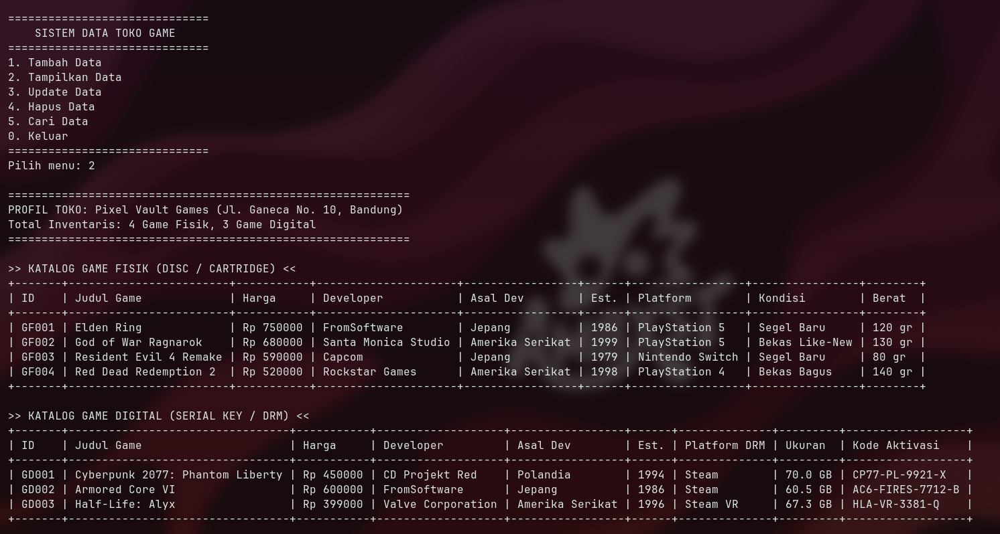 |

### 2. Python


| Tampilkan Data Sebelum (Show Before) | Tambah Game Fisik (Insert Physical) |
| :---: | :---: |
| 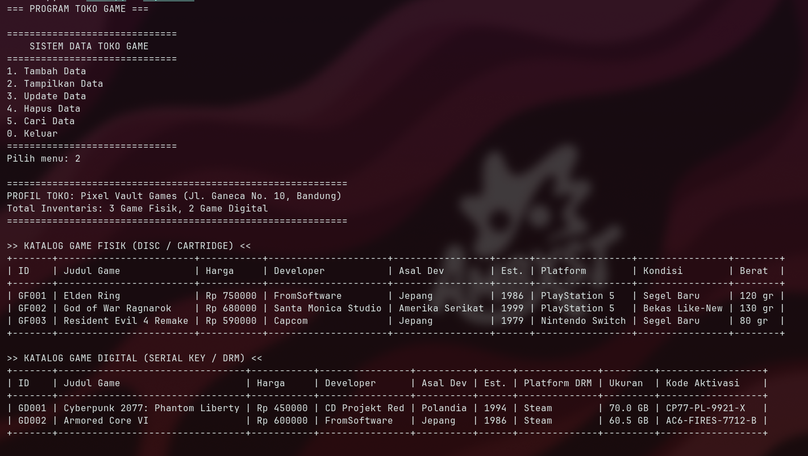 | 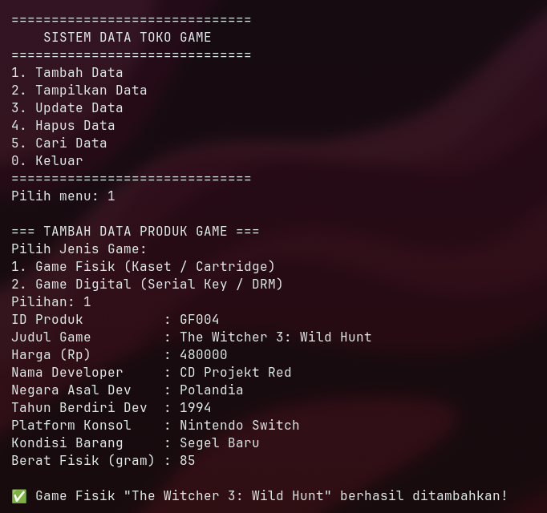 |
| **Tambah Game Digital (Insert Digital)** | **Tampilkan Data Setelah (Show After)** |
| 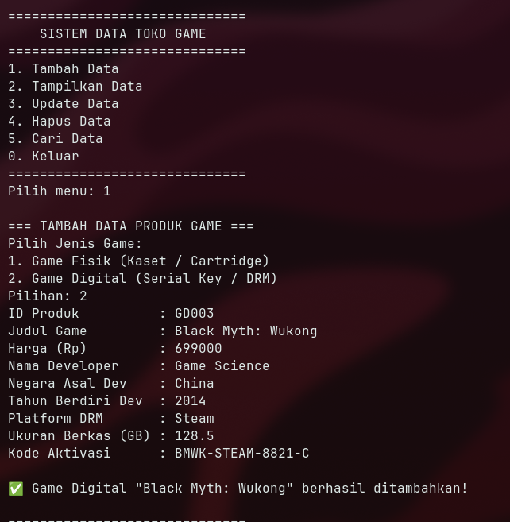 | 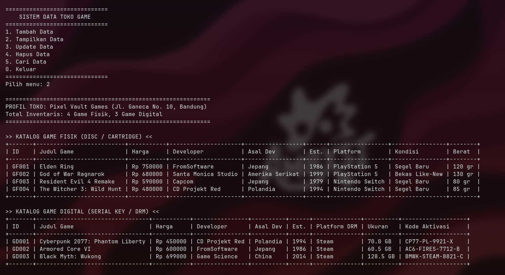 |

### 3. Java (Bonus)


| Tampilkan Data Sebelum (Show Before) | Tambah Game Fisik (Insert Physical) |
| :---: | :---: |
| 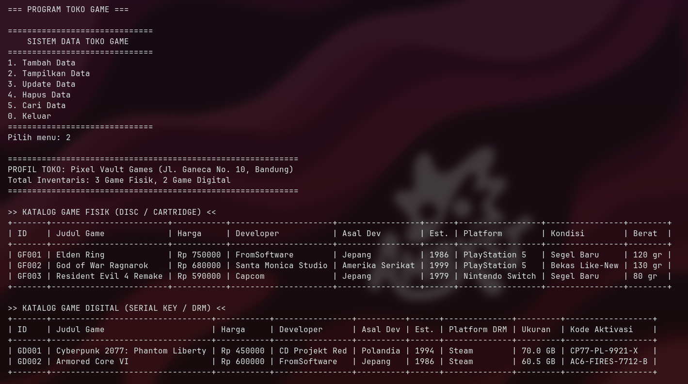 | 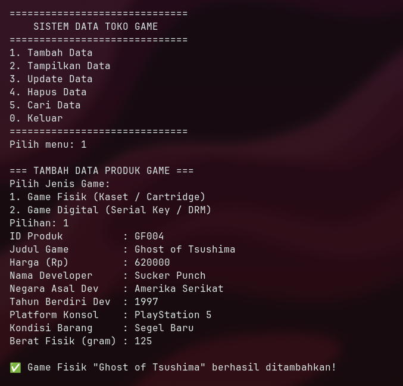 |
| **Tambah Game Digital (Insert Digital)** | **Tampilkan Data Setelah (Show After)** |
| 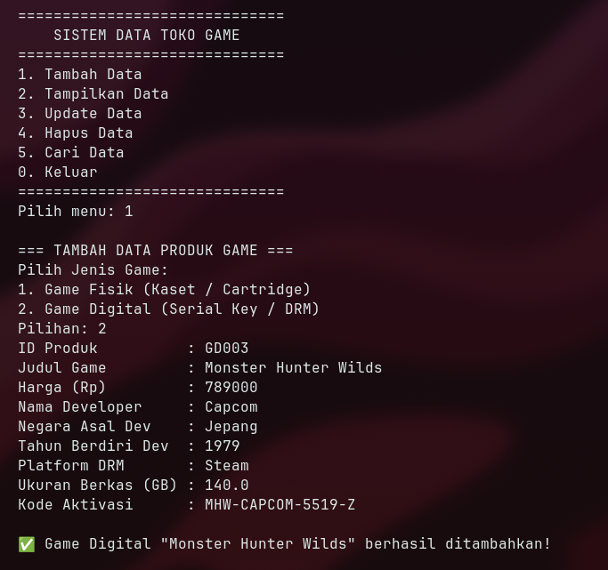 | 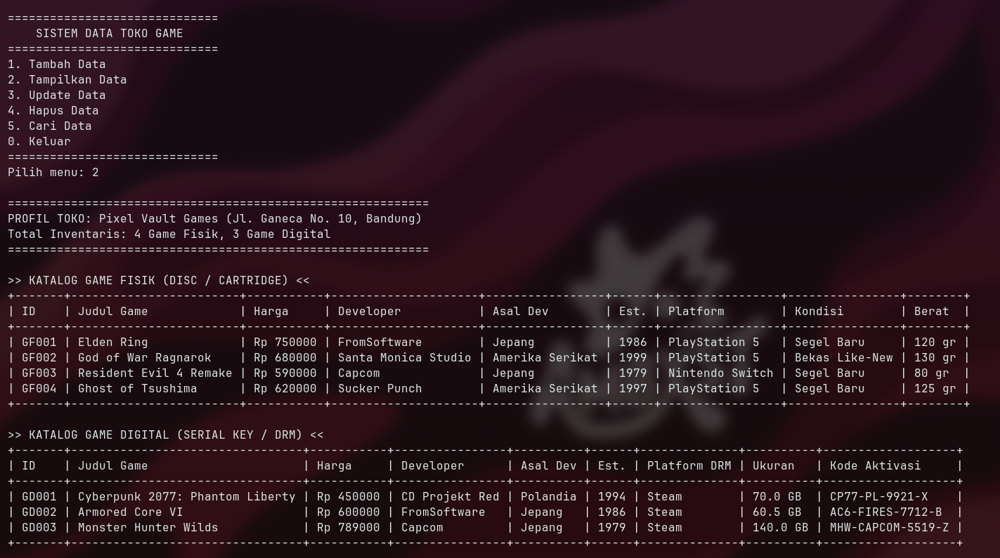 |
